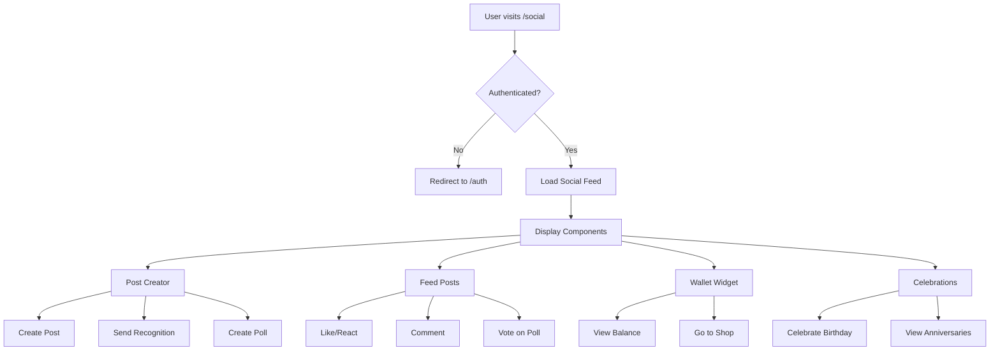
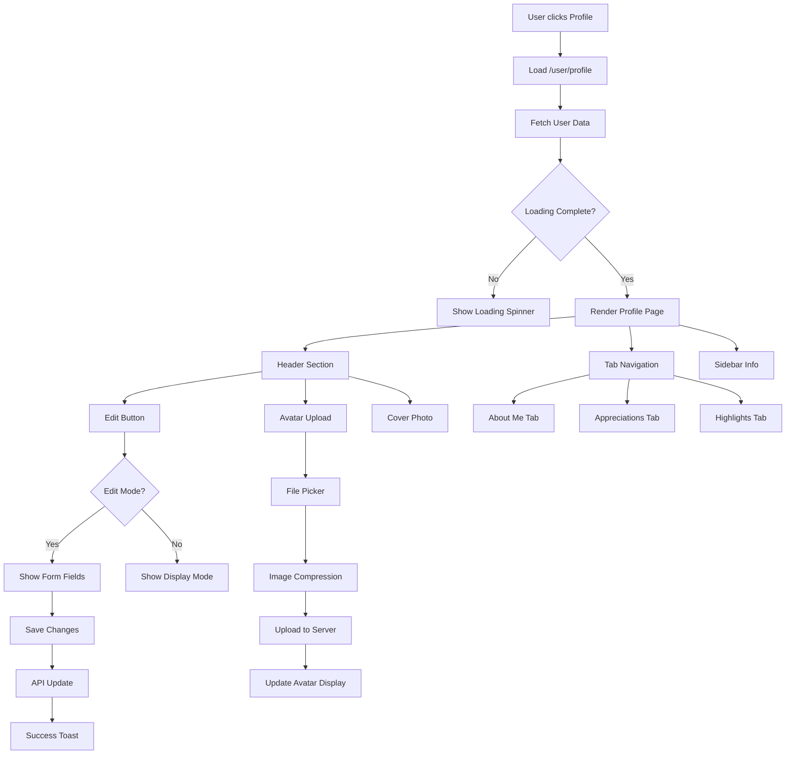
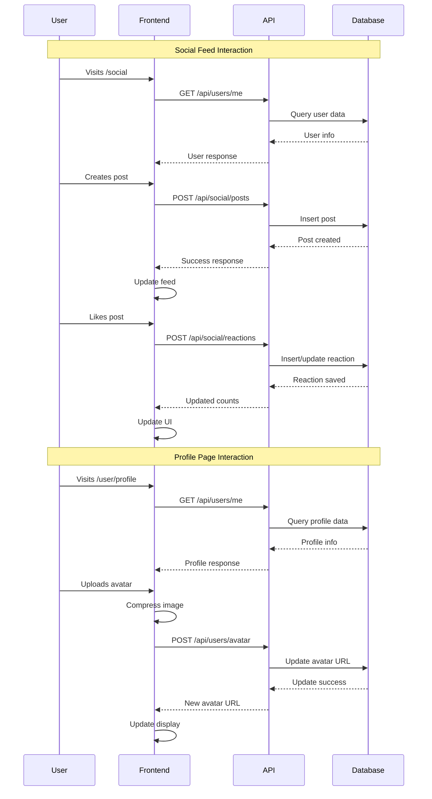

# Visual User Journey Diagrams

## Social Feed User Journey

```mermaid
graph TD
    A[User visits /social] --> B{Authenticated?}
    B -->|No| C[Redirect to /auth]
    B -->|Yes| D[Load Social Feed]
    
    D --> E[Display Components]
    E --> F[Post Creator]
    E --> G[Feed Posts]
    E --> H[Wallet Widget]
    E --> I[Celebrations]
    
    F --> J[Create Post]
    F --> K[Send Recognition]
    F --> L[Create Poll]
    
    G --> M[Like/React]
    G --> N[Comment]
    G --> O[Vote on Poll]
    
    H --> P[View Balance]
    H --> Q[Go to Shop]
    
    I --> R[Celebrate Birthday]
    I --> S[View Anniversaries]
```

## Profile Page User Journey

```mermaid
graph TD
    A[User clicks Profile] --> B[Load /user/profile]
    B --> C[Fetch User Data]
    C --> D{Loading Complete?}
    
    D -->|No| E[Show Loading Spinner]
    D -->|Yes| F[Render Profile Page]
    
    F --> G[Header Section]
    F --> H[Tab Navigation]
    F --> I[Sidebar Info]
    
    G --> J[Edit Button]
    G --> K[Avatar Upload]
    G --> L[Cover Photo]
    
    J --> M{Edit Mode?}
    M -->|Yes| N[Show Form Fields]
    M -->|No| O[Show Display Mode]
    
    N --> P[Save Changes]
    P --> Q[API Update]
    Q --> R[Success Toast]
    
    K --> S[File Picker]
    S --> T[Image Compression]
    T --> U[Upload to Server]
    U --> V[Update Avatar Display]
    
    H --> W[About Me Tab]
    H --> X[Appreciations Tab]
    H --> Y[Highlights Tab]
```

## User Interaction Flow

```mermaid
sequenceDiagram
    participant U as User
    participant F as Frontend
    participant A as API
    participant D as Database
    
    Note over U,D: Social Feed Interaction
    
    U->>F: Visits /social
    F->>A: GET /api/users/me
    A->>D: Query user data
    D-->>A: User info
    A-->>F: User response
    
    U->>F: Creates post
    F->>A: POST /api/social/posts
    A->>D: Insert post
    D-->>A: Post created
    A-->>F: Success response
    F->>F: Update feed
    
    U->>F: Likes post
    F->>A: POST /api/social/reactions
    A->>D: Insert/update reaction
    D-->>A: Reaction saved
    A-->>F: Updated counts
    F->>F: Update UI
    
    Note over U,D: Profile Page Interaction
    
    U->>F: Visits /user/profile
    F->>A: GET /api/users/me
    A->>D: Query profile data
    D-->>A: Profile info
    A-->>F: Profile response
    
    U->>F: Uploads avatar
    F->>F: Compress image
    F->>A: POST /api/users/avatar
    A->>D: Update avatar URL
    D-->>A: Update success
    A-->>F: New avatar URL
    F->>F: Update display
```
